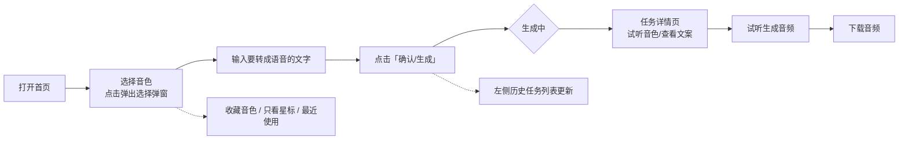

# TTS 文字转语音工具 — 项目总体需求（PRD）

> 版本：v1.0　|　日期：2026-08-27　|　状态：待评审
> 技术底座：Python 3.12 + FastAPI + SQLAlchemy 2 + Pydantic v2 + SQLite / Vue 3 + TypeScript + Vite + Element Plus
> 核心能力：基于 fal.ai **Index TTS 2.0**（`fal-ai/index-tts-2/text-to-speech`）的零样本语音克隆（Text-to-Speech）
> 参考项目：`F:\vox-video`（fal/外部 TTS 调用方式参考其 service 层 + API 路由 + 落库的模式）

---

## 目录

1. [项目概述](#1-项目概述)
2. [目标用户与使用场景](#2-目标用户与使用场景)
3. [用户旅程总览](#3-用户旅程总览)
4. [功能需求](#4-功能需求)
5. [后端设计](#5-后端设计)
6. [前端设计](#6-前端设计)
7. [非功能需求](#7-非功能需求)
8. [里程碑规划](#8-里程碑规划)
9. [附录](#9-附录)

---

## 1. 项目概述

一个**简单、本地化**的文字转语音（TTS）小工具：用户选择一个音色（内置或上传参考音频自定义），输入一段文字，即可用该音色生成一段自然语音，并可试听与下载。

- 音色来源两类：
  - **内置音色**：`assets/tone/` 下已有的大量参考音频（.wav / .mp3），由后端启动时扫描注册；
  - **自定义音色**：用户上传一段 10~30 秒的干净人声音频，作为零样本克隆的参考音色。
- 语音生成：调用 fal.ai **Index TTS 2.0** 官方接口，零样本语音克隆（无需训练，直接给定参考音频 + 文案即可生成）。
- 形态：单机本地 Web 应用（前后端分离，浏览器访问），无需账号体系。

### 1.1 核心价值

- 配音门槛低：不用找付费配音平台，选个音色粘贴文案即可出语音；
- 音色自由度高：几百个内置音色 + 自定义克隆音色；
- 管理顺手：收藏 / 过滤 / 最近使用，解决「音色多到挑花眼」的问题。

---

## 2. 目标用户与使用场景

| 用户 | 典型场景 |
|---|---|
| 短视频创作者 / 自媒体 | 给视频配解说、口播，需要多种风格的男声/女声 |
| 内容搬运 / 二创 | 用固定某几个常用音色批量产出语音 |
| 有声内容 / 课程制作 | 将文案批量转成语音 |
| 普通用户 | 偶尔把一段文字变成语音（试玩、分享） |

**关键点**：音色数量庞大（`assets/tone/` 已有数百个），因此**音色的「找」与「管」比「生成」本身更影响体验**——必须提供收藏、过滤、最近使用、搜索与试听。

---

## 3. 用户旅程总览



### 3.1 旅程描述（对应附图 1、附图 2）

1. **打开项目**（附图 1）：
   - 左侧是**导航栏**，顶部为品牌区，下方列出**历史任务**（每条即一个历史任务入口，点击进入详情）；
   - 中间是**输入区**，包含两个核心功能：
     - **选择音色**：点击后弹出悬浮窗（附图 2）；
     - **输入文字**：输入需要转成语音的文字；
   - 底部/角落为「确认生成」按钮。
2. **选择音色弹窗**（附图 2）：
   - 两个 Tab：**内置音色** / **上传自定义音色**；
   - 内置音色列表：每个音色一张卡片（头像/名称/性别标签/「内置」标签/**播放**按钮），可试听参考音频；
   - 顶部可**搜索音色名**、可**只看星标**过滤；
   - 提供**最近使用**音色分组；
   - 每张卡片有**星标收藏**按钮；
   - 底部「确定」按钮确认所选音色。
3. **确认后进入任务详情页**：
   - 查看并**试听**本次选择的音色（参考音频）；
   - 查看本次**转音频的文字**；
   - **试听生成的音频**；
   - **下载生成的音频**。

---

## 4. 功能需求

### 4.1 首页（任务列表 + 输入区）

| 编号 | 需求 | 说明 |
|---|---|---|
| F-1.1 | 左侧导航栏 | 顶部品牌区（如「TTS 语音合成」）；功能入口「新建任务」；下方「最近」历史任务列表 |
| F-1.2 | 历史任务列表 | 按创建时间倒序展示；每项显示：状态图标（成功/失败/生成中）、音色名、文字摘要、时间；点击进入详情页 |
| F-1.3 | 历史任务搜索 | 顶部提供搜索框，按任务文字/音色名模糊过滤（可选，建议首版实现） |
| F-1.4 | 输入区 | 中间主区域：**选择音色**（按钮 + 已选音色展示 + 试听）、**文字输入框**（多行 textarea，可显示字数）、「确认生成」按钮 |
| F-1.5 | 生成入口校验 | 未选音色或文字为空时按钮禁用/提示；文字长度超限（默认 2000 字，可配置）时提示 |
| F-1.6 | 生成后跳转 | 点击确认 → 创建任务 → 跳转任务详情页；新任务插入左侧列表顶部 |

### 4.2 音色选择弹窗（附图 2）

| 编号 | 需求 | 说明 |
|---|---|---|
| F-2.1 | 弹窗形态 | `el-dialog` 悬浮窗；标题「选择音色」；右上角关闭；底部「确定」按钮（蓝底） |
| F-2.2 | 双 Tab | **内置音色** / **上传自定义音色** |
| F-2.3 | 内置音色列表 | 卡片列表，支持滚动；每卡片：圆形头像（首字/图标）、音色名、性别标签（男/女）、「内置」标签、**播放**按钮、**星标**按钮 |
| F-2.4 | 试听 | 点击「播放」即播放该音色的参考音频（内置音色播 `assets/tone` 源文件，自定义音色播上传的音频）；支持停止切换 |
| F-2.5 | 选中态 | 当前选中的卡片高亮（蓝色描边），底部「确定」返回选中音色 |
| F-2.6 | 搜索 | 顶部搜索框按音色名模糊过滤（内置 + 自定义） |
| F-2.7 | 只看星标 | 顶部开关「只看星标」，打开后列表只显示已收藏音色 |
| F-2.8 | 最近使用 | 列表顶部（或独立分组）展示最近使用的音色（按使用时间倒序，默认展示 10 个） |
| F-2.9 | 上传自定义音色 | Tab 2：拖拽/点击上传一段音频（wav/mp3/m4a，≤50MB，建议 10~30s 干净人声）；可命名；上传后自动加入自定义音色列表并可选中 |
| F-2.10 | 自定义音色管理 | 自定义音色同样支持：试听、星标收藏、搜索、最近使用、被任务引用 |
| F-2.11 | 空态/加载态 | 列表加载中显示骨架/loading；无结果显示「无匹配音色」 |

### 4.3 任务生成

| 编号 | 需求 | 说明 |
|---|---|---|
| F-3.1 | 创建任务 | `POST /api/tasks`，入参：`voice_id` + `text`；后端异步调用 fal.ai 生成 |
| F-3.2 | 状态流转 | `pending → running → succeeded / failed`；生成失败记录 `error_message` 供前端展示 |
| F-3.3 | 进度反馈 | 前端轮询（默认 2s）任务详情，展示「生成中…」loading；可选升级为 SSE/WebSocket 实时推送 |
| F-3.4 | 失败兜底 | 网络异常 / fal 调用失败 / 超时（默认 60s）均 catch + 记录日志，任务置 `failed` 并给出可读错误提示 |

### 4.4 任务详情页

| 编号 | 需求 | 说明 |
|---|---|---|
| F-4.1 | 音色信息 | 展示本次使用的音色：名称、性别、「内置/自定义」标签、**试听参考音频**按钮 |
| F-4.2 | 文案展示 | 展示本次转语音的文字（只读，可复制） |
| F-4.3 | 生成结果 | 成功：内嵌播放器**试听生成音频**（支持进度/播放/暂停）；失败：错误提示 + 「重新生成」按钮 |
| F-4.4 | 下载 | 「下载音频」按钮（`Content-Disposition: attachment`，文件名如 `TTS_任务ID_音色名.mp3`） |
| F-4.5 | 重新生成 | 对同一 voice_id + text 重新发起任务（可选，建议首版实现） |
| F-4.6 | 返回/删除 | 返回首页；删除任务（可选，建议 v1.1） |

### 4.5 音色管理能力（收藏 / 过滤 / 最近使用）

| 编号 | 需求 | 说明 |
|---|---|---|
| F-5.1 | 星标收藏 | 列表卡片星标按钮点击即收藏/取消收藏；状态持久化（落库） |
| F-5.2 | 只看星标 | 弹窗内开关过滤出全部已收藏音色 |
| F-5.3 | 最近使用 | 用户每次成功创建任务，即把该音色记为「最近使用」（`last_used_at` 更新）；弹窗内独立展示 |
| F-5.4 | 数据来源 | 收藏与最近使用均针对**音色维度**（内置 + 自定义统一处理） |

---

## 5. 后端设计

### 5.1 系统架构

```mermaid
flowchart LR
    subgraph 前端 Frontend (Vue3+ElementPlus)
        A[首页/输入区] --> B[音色选择弹窗]
        C[任务详情页]
    end
    subgraph 后端 Backend (FastAPI)
        D[API 路由层]
        E[Service 层<br/>voice_service / tts_service]
        F[音色库同步<br/>扫描 assets/tone]
        G[fal.ai 集成<br/>fal_client]
        H[(SQLite<br/>voices / tts_tasks)]
    end
    A --> D
    C --> D
    D --> E
    E --> H
    E --> G
    F --> H
    G -->|生成音频| I[workplace/<br/>生成音频目录]
    I --> D --> C
```

- **单进程部署**：FastAPI 提供 API；任务生成用后台异步任务（`asyncio` 任务或线程池），避免阻塞请求线程。
- **音频存储**：参考音频源文件在 `assets/tone/`（内置）；用户上传的参考音频与生成的音频统一存到 `workplace/` 下（`workplace/uploads/` 自定义音色上传、`workplace/generated/` 生成音频，路径由 `OUTPUT_DIR` / `UPLOAD_DIR` 配置）。
- **fal.ai 密钥**：仅存在于后端 `backend/.env`（`FAL_KEY`），**绝不暴露到前端**。

### 5.2 fal.ai Index TTS 2.0 集成（官方 API）

> 官方文档：<https://fal.ai/models/fal-ai/index-tts-2/text-to-speech/api>

#### 5.2.1 模型与鉴权

| 项 | 值 |
|---|---|
| 模型标识 | `fal-ai/index-tts-2/text-to-speech` |
| Python 客户端 | `pip install fal-client` |
| API Key | 环境变量 `FAL_KEY`（后端 `.env`），HTTP 头 `Authorization: Key {FAL_KEY}` |
| ⚠️ 安全 | 官方明确要求：**FAL_KEY 不得出现在浏览器/客户端代码中**，必须由服务端代理调用 |

#### 5.2.2 输入 Schema（官方）

| 字段 | 类型 | 必填 | 说明 |
|---|---|---|---|
| `audio_url` | string | ✅ | **参考音频 URL**（用于提取说话人音色），支持 fal 托管 URL / 公开 URL / base64 data URI |
| `prompt` | string | ✅ | **要合成的文字**（语音文案） |
| `emotional_audio_url` | string | — | 情感参考音频（提取风格） |
| `strength` | float | — | 情感风格迁移强度，默认 `1` |
| `emotional_strengths` | object | — | 细粒度情感强度：`happy/angry/sad/afraid/disgusted/melancholic/surprised/calm` |
| `should_use_prompt_for_emotion` | boolean | — | 用 `prompt` 计算情感强度；置 true 会覆盖 `emotional_strengths` |
| `emotion_prompt` | string | — | 情感提示词（须与 `should_use_prompt_for_emotion` 同用） |

示例请求体：

```json
{
  "audio_url": "https://storage.googleapis.com/falserverless/example_inputs/index-tts-2/tts_in.mp3",
  "prompt": "今天天气真不错，我们一起去公园散步吧。",
  "strength": 1,
  "emotional_strengths": null,
  "should_use_prompt_for_emotion": true,
  "emotion_prompt": "轻松愉快地朗读"
}
```

#### 5.2.3 输出 Schema（官方）

```json
{
  "audio": {
    "url": "https://storage.googleapis.com/falserverless/example_outputs/index-tts-2/tts_out.mp3",
    "content_type": "audio/mpeg",
    "file_name": "tts_out.mp3",
    "file_size": 123456
  }
}
```

#### 5.2.4 Python 调用（同步订阅）

```python
import fal_client

result = fal_client.subscribe(
    "fal-ai/index-tts-2/text-to-speech",
    arguments={
        "audio_url": "https://.../参考音频.mp3",
        "prompt": "要合成的文字",
    },
    with_logs=True,
)
audio_url = result["audio"]["url"]   # 生成的音频 URL
```

#### 5.2.5 文件处理（参考音频）

- fal 官方推荐把本地音频上传到 fal 存储，拿到 URL 再传入：
  ```python
  url = fal_client.upload_file("assets/tone/示例音色.wav")
  ```
- 或直接传 **base64 data URI**（大文件会影响请求性能，不推荐）；
- **本项目策略**：内置音色首次使用时上传一次，把返回的 fal URL 缓存进 `voices.fal_audio_url`（幂等，已有则不再上传）；自定义音色在注册时上传一次。

#### 5.2.6 队列模式（异步，生产推荐）

```python
handler = fal_client.submit(
    "fal-ai/index-tts-2/text-to-speech",
    arguments={"audio_url": "...", "prompt": "..."},
    webhook_url="https://optional.webhook.url/for/results",
)
request_id = handler.request_id
status = fal_client.status("fal-ai/index-tts-2/text-to-speech", request_id, with_logs=True)
result = fal_client.result("fal-ai/index-tts-2/text-to-speech", request_id)
```

**本项目**：本地小工具用 `subscribe`（阻塞）放入后台任务即可；如生成频繁/超时可迁移到 `submit` + 轮询 `status`。

#### 5.2.7 服务层封装（参考 vox-video 模式）

参考 `F:\vox-video\server\services\voice-generation.ts` 的封装思路，新增 `backend/app/services/fal_tts.py`：

```python
"""fal.ai Index TTS 2.0 语音合成封装。"""

from __future__ import annotations

import fal_client
from app.config import get_settings

def synthesize(audio_url: str, prompt: str) -> str:
    """调用 fal.ai Index TTS 2.0 生成语音，返回生成的音频 URL。"""
    settings = get_settings()
    result = fal_client.subscribe(
        settings.fal_model,
        arguments={"audio_url": audio_url, "prompt": prompt},
    )
    return result["audio"]["url"]  # type: ignore[index]

def upload_reference_audio(local_path: str) -> str:
    """把本地参考音频上传到 fal 存储，返回可用的 URL。"""
    return fal_client.upload_file(local_path)  # type: ignore[no-any-return]
```

> 注意：跨边界调用一律 try/except + logger.warning（见 AGENTS.md §4），单次失败不能炸掉整个任务。

### 5.3 API 接口设计（REST）

统一前缀 `/api`，JSON 交互。

#### 5.3.1 音色

| 方法 | 路径 | 说明 | 请求 | 响应 |
|---|---|---|---|---|
| GET | `/api/voices` | 音色列表 | query：`search`（名称模糊）、`only_favorite`（只看星标）、`recent`（最近使用，如 `recent=10`）、`gender`、`is_builtin`（`true`=仅内置 / `false`=仅自定义，实现补充）、`page/page_size` | `{ list: Voice[], total }`；每项含 `is_favorite`、`last_used_at` |
| POST | `/api/voices` | 注册自定义音色 | multipart：`file`（音频）+ `name` | 创建的 `Voice` |
| POST | `/api/voices/rescan` | 重新扫描内置音色（实现补充，幂等） | — | `{ added: number }` |
| GET | `/api/voices/{id}/audio` | 试听参考音频（流式，支持 Range） | — | 音频字节流 |
| POST | `/api/voices/{id}/favorite` | 收藏音色 | — | `{ is_favorite: true }` |
| DELETE | `/api/voices/{id}/favorite` | 取消收藏 | — | `{ is_favorite: false }` |

#### 5.3.2 任务

| 方法 | 路径 | 说明 | 请求 | 响应 |
|---|---|---|---|---|
| POST | `/api/tasks` | 创建 TTS 任务 | `{ voice_id, text }` | `Task`（含 `id/status`） |
| GET | `/api/tasks` | 历史任务列表（侧栏） | query：`search`、`page/page_size` | `{ list: Task[], total }` |
| GET | `/api/tasks/{id}` | 任务详情 | — | `Task`（含音色信息、文字、状态、音频 URL） |
| GET | `/api/tasks/{id}/audio` | 试听生成的音频（流式，支持 Range） | — | 音频字节流 |
| GET | `/api/tasks/{id}/download` | 下载生成的音频 | — | `Content-Disposition: attachment` |
| POST | `/api/tasks/{id}/regenerate` | 重新生成（可选） | — | 新 `Task` |
| DELETE | `/api/tasks/{id}` | 删除任务（可选，v1.1） | — | 204 |

> 音频流式接口用 `FileResponse`（FastAPI 原生支持 Range，浏览器 `<audio>` 可拖动进度）。

### 5.4 数据库设计（SQLite + SQLAlchemy 2 + Alembic）

> 遵循 AGENTS.md §6：建表用 `Mapped[T]` + `mapped_column()`；结构变更需产出 `PRD/sql/migrations/NNNN_*.sql` 增量脚本（幂等）。

#### 5.4.1 `voices`（音色表）

| 字段 | 类型 | 说明 |
|---|---|---|
| `id` | int PK | 主键 |
| `name` | str | 音色名（内置=文件名去扩展名并清洗；自定义=用户命名） |
| `source_path` | str \| None | 参考音频本地路径（内置=相对 `assets/tone/`；自定义=上传存储路径） |
| `is_builtin` | bool | 是否内置音色 |
| `gender` | str \| None | `male` / `female` / `unknown`（可从文件名启发式识别，如含「男/女」） |
| `fal_audio_url` | str \| None | 上传到 fal 存储后的 URL（缓存，幂等复用） |
| `sample_text` | str \| None | 试听文案（可选，展示用） |
| `is_favorite` | bool | 星标收藏（单用户工具，直接落音色行；如需多用户再拆 `favorites` 表） |
| `last_used_at` | datetime \| None | 最近使用时间（创建任务时更新） |
| `created_at` | datetime | 创建时间 |

```python
class Voice(Base):
    __tablename__ = "voices"

    id: Mapped[int] = mapped_column(primary_key=True)
    name: Mapped[str] = mapped_column(index=True)
    source_path: Mapped[str | None]
    is_builtin: Mapped[bool] = mapped_column(default=True)
    gender: Mapped[str | None]
    fal_audio_url: Mapped[str | None]
    sample_text: Mapped[str | None]
    is_favorite: Mapped[bool] = mapped_column(default=False)
    last_used_at: Mapped[datetime | None]
    created_at: Mapped[datetime] = mapped_column(default=datetime.now)
```

#### 5.4.2 `tts_tasks`（任务表）

| 字段 | 类型 | 说明 |
|---|---|---|
| `id` | int PK | 主键 |
| `voice_id` | int FK→voices.id | 使用的音色 |
| `text` | str | 要转语音的文字 |
| `status` | str | `pending` / `running` / `succeeded` / `failed` |
| `audio_path` | str \| None | 生成的音频本地路径 |
| `error_message` | str \| None | 失败原因 |
| `duration_seconds` | float \| None | 音频时长（可选，用于展示） |
| `created_at` | datetime | 创建时间 |
| `updated_at` | datetime | 更新时间 |
| `completed_at` | datetime \| None | 完成时间 |

```python
class TtsTask(Base):
    __tablename__ = "tts_tasks"

    id: Mapped[int] = mapped_column(primary_key=True)
    voice_id: Mapped[int] = mapped_column(ForeignKey("voices.id"), index=True)
    text: Mapped[str]
    status: Mapped[str] = mapped_column(default="pending", index=True)
    audio_path: Mapped[str | None]
    error_message: Mapped[str | None]
    duration_seconds: Mapped[float | None]
    created_at: Mapped[datetime] = mapped_column(default=datetime.now)
    updated_at: Mapped[datetime] = mapped_column(default=datetime.now, onupdate=datetime.now)
    completed_at: Mapped[datetime | None]
```

#### 5.4.3 音色库同步（内置音色注册）

- 后端启动时（或提供一次性脚本）扫描 `assets/tone/`：
  - 文件名（去扩展名）作为音色名；
  - 已存在的（按 name + source_path）跳过，新增的插入 —— **幂等可重跑**；
  - 不删除本地已不存在的 DB 记录（保守策略，避免误删收藏/历史引用）。
- 新音色文件放入 `assets/tone/` 后重启后端（或触发 rescan 接口）即可生效。

### 5.5 配置项（`backend/.env` → `app/config.py`）

| 配置项 | 类型 | 默认值 | 说明 |
|---|---|---|---|
| `FAL_KEY` | str | （必填，已存在） | fal.ai API Key，**绝不提交/不写文档真实值** |
| `FAL_MODEL` | str | `fal-ai/index-tts-2/text-to-speech` | 模型标识 |
| `FAL_REQUEST_TIMEOUT` | int | 300 | 生成总超时（秒）：排队 + 推理全过程（Index TTS 2.0 推理可能 30~90s+，原 60 会过早取消） |
| `FAL_START_TIMEOUT` | int | 120 | 服务端开始处理前的排队超时（秒），不限制推理时长 |
| `OUTPUT_DIR` | str | `workplace/generated` | 生成音频输出目录（`workplace/` 已在 `.gitignore`） |
| `UPLOAD_DIR` | str | `workplace/uploads` | 自定义音色上传目录（`workplace/` 已在 `.gitignore`） |
| `VOICE_SCAN_DIR` | str | `assets/tone` | 内置音色扫描目录 |
| `TASK_POLL_INTERVAL` | int | 2 | 前端轮询间隔（秒）（可前端常量） |
| `MAX_TEXT_LENGTH` | int | 2000 | 单次文案最大字数 |

> 新增配置遵循 AGENTS.md §5/§6：`config.py` 加字段 → `.env` 加示例 → 产出 `PRD/sql/env/prdNN-*.env` 增量清单（FAL_KEY 写 `<placeholder>`）。

---

## 6. 前端设计

### 6.1 页面结构（Vue 3 + TS + Vite + Element Plus）

```
frontend/src/
  main.ts
  App.vue                    # 整体布局：左侧 Sidebar + 右侧内容区（router-view）
  router/index.ts            # 路由：/（首页）、/task/:id（详情）
  types/index.ts             # 与后端对齐的类型定义（Voice / TtsTask / ...）
  api/index.ts               # axios 封装 + 各接口方法
  views/
    HomeView.vue             # 首页：输入区 + 音色选择
    TaskDetailView.vue       # 任务详情页
  components/
    AppSidebar.vue           # 左侧导航栏：品牌 + 历史任务列表 + 搜索
    TaskInputPanel.vue       # 中间输入区：选择音色 + 文字输入 + 生成
    VoiceSelectorDialog.vue  # 音色选择弹窗（附图 2）
    VoiceCard.vue            # 音色卡片（播放/星标/选中）
    AudioPlayer.vue          # 音频播放器封装（HTML5 <audio>）
    TaskStatusTag.vue        # 任务状态标签（生成中/成功/失败）
```

### 6.2 页面与组件要点

| 组件 | 要点 |
|---|---|
| `AppSidebar` | 顶部品牌区 +「新建任务」入口；「最近」分组：历史任务卡片（状态图标 + 音色名 + 文字摘要 + 时间）；搜索框过滤历史任务 |
| `TaskInputPanel` | 左侧已选音色卡片（名称 + 试听按钮 + 更换按钮）；右侧多行 `el-input type="textarea"`（显示字数）；底部「确认生成」按钮（`el-button type="primary"`） |
| `VoiceSelectorDialog` | `el-dialog`；`el-tabs`：内置音色 / 上传自定义音色；内置 Tab 顶部：搜索框 + 「只看星标」开关 + 「最近使用」分组；`el-scrollbar` 内渲染 `VoiceCard` 列表；底部「确定」按钮回传选中音色 |
| `VoiceCard` | 圆形头像（音色名首字）、名称、性别/来源标签（`el-tag`）、播放按钮、星标按钮（`el-icon` Star/StarFilled）；选中态蓝色描边高亮；点击卡片选中 |
| `AudioPlayer` | 封装 `<audio controls>`，支持 URL 播放/暂停/进度；试听参考音频与生成音频共用 |
| `TaskDetailView` | 面包屑/返回；音色信息卡片（试听参考音频）；文案展示（只读 + 复制）；生成结果区：`AudioPlayer`（成功）/ 错误提示 + 重新生成（失败）/ loading（生成中）；「下载音频」按钮（`el-button` + `a[download]`） |

### 6.3 类型定义（与后端 schema 对齐）

```ts
// types/index.ts —— 与后端 Pydantic 模型字段一一对应
export interface Voice {
  id: number
  name: string
  isBuiltin: boolean
  gender: 'male' | 'female' | 'unknown' | null
  isFavorite: boolean
  lastUsedAt: string | null
  createdAt: string
  // 前端用于试听：GET /api/voices/{id}/audio
}

export type TaskStatus = 'pending' | 'running' | 'succeeded' | 'failed'

export interface TtsTask {
  id: number
  voice: Voice
  text: string
  status: TaskStatus
  audioUrl: string | null   // /api/tasks/{id}/audio
  errorMessage: string | null
  createdAt: string
  completedAt: string | null
}

export interface Paged<T> {
  list: T[]
  total: number
}
```

---

## 7. 非功能需求

| 类别 | 要求 |
|---|---|
| 性能 | 列表接口 < 200ms（分页 + 索引）；生成异步化，不阻塞请求；音频流式接口支持 Range（拖动播放） |
| 稳定性 | 所有外部调用（fal、文件读写）try/except + `logger.warning(..., exc)`；单任务失败不影响其他任务；任务状态用 `updated_at` 兜底回收长时间卡在 running 的脏数据为 failed（超时阈值可配置） |
| 安全 | `FAL_KEY` 仅后端使用，前端绝不暴露；上传文件做类型/大小校验（wav/mp3/m4a，≤50MB）；路径拼接防目录穿越 |
| 数据 | SQLite 文件放 `database/`；运行生成的产物（生成音频、用户上传音频）统一放 `workplace/`（已在 `.gitignore`）；`.env` / `.venv` / `node_modules` / `assets/` 不提交 |
| 可维护性 | 遵循 AGENTS.md：docstring + `from __future__ import annotations`、类型注解齐全、Pydantic v2、SQLAlchemy 2、配置走 `Settings`、日志不 print |

---

## 8. 里程碑规划

| 阶段 | 内容 | 验收 |
|---|---|---|
| M1 后端基础 | FastAPI 骨架 + SQLite 模型 + Alembic + 音色库扫描注册 + `GET /api/voices` | 启动后 DB 有全部内置音色；接口可返回列表 |
| M2 fal 集成 | `fal_tts.py` + 参考音频上传缓存 + `POST /api/tasks` 后台生成 + 音频落盘/流式接口 | 用任意内置音色生成一段语音成功 |
| M3 首页 + 音色弹窗 | Sidebar + 输入区 + 音色选择弹窗（试听/搜索/星标/最近使用/上传自定义） | 按附图 1/2 交互走通 |
| M4 任务详情 + 下载 | 详情页试听音色/文案/生成音频 + 下载 + 失败重试 | 完整用户旅程可跑通 |
| M5 打磨 | 空态/加载态、错误提示、任务搜索、重新生成、文档收尾（PRD/sql 同步产物） | 冒烟测试通过 |

---

## 9. 附录

### A. fal.ai Index TTS 2.0 官方 API 速查

- 模型：`fal-ai/index-tts-2/text-to-speech`
- 客户端：`pip install fal-client`；环境变量 `FAL_KEY`
- 必填入参：`audio_url`（参考音频）、`prompt`（文案）
- 可选入参：`emotional_audio_url` / `strength` / `emotional_strengths` / `should_use_prompt_for_emotion` / `emotion_prompt`
- 出参：`{ "audio": { "url", "content_type", "file_name", "file_size" } }`
- 参考音频文件：`fal_client.upload_file(path)` 上传后使用返回 URL；或 base64 data URI / 公开 URL
- 异步队列：`submit` → `request_id` → `status(request_id)` → `result(request_id)`；支持 `webhook_url`
- ⚠️ 官方警示：不要把 `FAL_KEY` 暴露在浏览器端，必须服务端代理调用

### B. 内置音色库说明（`assets/tone/`）

- 现有数百个 .wav/.mp3 参考音频；音色名 = 文件名去扩展名；
- 部分文件名含性别/风格关键词（如「男/女/少年/御姐」），可用启发式规则提取 `gender` 与标签展示，识别失败归为 `unknown`；
- 新增音色：把音频放入 `assets/tone/` 后重启后端（或触发 rescan）自动注册，无需改代码。

### C. 数据库 / 配置同步约定（AGENTS.md §6）

- 涉及数据库结构 → `PRD/sql/migrations/NNNN_简短英文描述.sql`（幂等，如 `CREATE TABLE IF NOT EXISTS` / `ALTER TABLE ... ADD COLUMN IF NOT EXISTS`）；
- 涉及 `.env` → `PRD/sql/env/prdNN-简短描述.env`（只列增量，敏感字段用 `<placeholder>`）；
- 本次 PRD 首次落地实现的建表 SQL 即为 `0001_init_voices_tasks.sql`。

### D. 实现说明（首次落地 v0.1，2026-08-27）

> 记录实现过程中的关键决策与偏差，后续改动前先读这里。

- **自定义音色 fal 上传采用懒加载**：注册自定义音色时不立即上传 fal（避免注册请求被网络阻塞），改为首次生成任务时通过 `get_voice_audio_url()` 上传并幂等缓存 `voices.fal_audio_url`（与内置音色一致）。
- **fal_client 超时参数**：`fal-client` 的 `subscribe()` 用 `start_timeout` / `client_timeout`（不是 `timeout`）。`start_timeout`=服务端开始处理前的排队等待上限；`client_timeout`=整个请求（排队+推理）总时长。总超时 `FAL_REQUEST_TIMEOUT` 默认 300s（Index TTS 2.0 推理可能 30~90s+，原 60s 会过早取消任务报 "timed out after 60 seconds"）；排队超时 `FAL_START_TIMEOUT` 默认 120s。超时单独捕获并输出可读错误提示。
- **中文文件名兼容**：`assets/tone/` 大量音色文件名为中文，fal_client 的 v3 上传对非 ASCII 路径有 `ascii` codec 缺陷；`fal_tts.upload_reference_audio()` 会把非 ASCII 文件复制为 ASCII 临时文件名再上传（上传后删除临时文件）。
- **`GET /api/voices` 新增 `is_builtin` 过滤**：内置/自定义 Tab 各自分页需要后端过滤（前端按页过滤会因内置优先排序取不到自定义音色）。
- **`POST /api/voices/rescan`**：新增重扫内置音色接口（幂等），配合 PRD §5.4.3「重启或触发 rescan」。
- **前后端字段映射**：后端 Pydantic 输出 snake_case，前端在 axios 响应拦截器统一转 camelCase（`is_builtin` → `isBuiltin` 等），`frontend/src/types/index.ts` 类型与后端对齐。
- **任务回收**：`recycle_stale_tasks` 同时回收超时的 `running` 和 `pending`（防调度前崩溃遗留的 pending 脏数据）。
